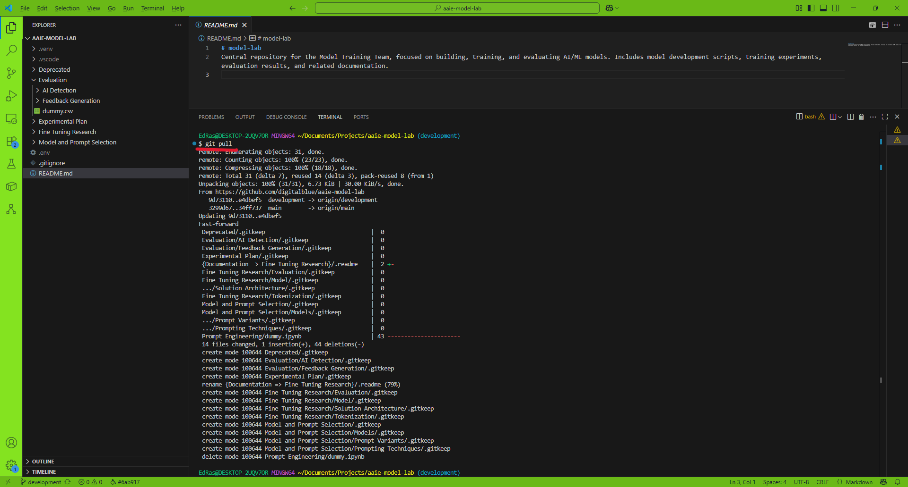

# Guide to update you repo
This guide is to update your forked repo with latest folder changes for **AAIE-Model-Lab** repo.

### 1. Update your Github forked  main and development branches
Navigate to you forked repo on GitHub and look for the `Sync fork` button.

Ensure you have selected `development` branch. Note the older folder structure and then press `Update branch`.

After this process completes, you GitHub `development` branch will be updated with new folder structure.

### 2. Pull changes to your local branch
In Vscode, or terminal , use git to checkout the `development` branch.

Type `git pull`. This will pull in all the remote changes into your local `development` branch. Take note of the change in folder structure.

## 3. Apply the change to your feature branches or pull requests
Use git to checkout the branch you want to apply changes from `development` branch. Then `git merge development` into your feature branch. This will most likely show a merge **CONFLICT** due to changes in folder structure.

You will need to manually fix any conflicts. In this example, the .md file simply had to be moved to one of the new folders. Then `git add .` the updates, `git merge` to complete the merge process. The git commit message should be applied.

`git push` your changes to remote feature branch.

Verify on GitHub that the folder structure changes have been applied to your remote pull request or feature branch.

