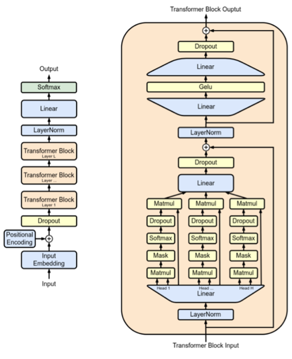

# NanoGPT

## I. Overview

NanoGPT is a minimalist implementation of the GPT architecture built in PyTorch, designed to be fast, lightweight, and easy to develop with. It is particularly well-suited for creating small to medium-sized GPT models, whether by training from scratch or fine-tuning pretrained weights. NanoGPT emphasizes clarity and efficiency, making it ideal for training autoregressive language models on custom datasets.

This project was developed by Andrej Karpathy, a well-known researcher affiliated with OpenAI, and has been released as an open-source repository under the MIT license. The code and documentation for NanoGPT are freely available on GitHub, allowing researchers, educators, and developers to explore, modify, and extend the model.

Due to its relatively small size and simple design, NanoGPT is a versatile tool for general-purpose language modeling and text generation. It is especially effective for fine-tuning on domain-specific datasets, enabling users to build customized chatbots, AI assistants, or language models tailored to specialized tasks and fields.

## II. Model Architecture

### a) Model Size

By default, NanoGPT is designed to replicate the architecture and scale of the smallest publicly released GPT-2 model, which contains approximately 124 million parameters. At the other end of the spectrum, the largest released GPT model in this family, GPT-2 XL, consists of around 1.558 billion parameters, offering significantly greater capacity and complexity.

In practical terms, the default configuration file provided with NanoGPT (train_gpt2.py) is set up specifically to reproduce the behavior and performance of the GPT-2 124M model when trained on a large-scale text dataset such as OpenWebText.

### b) Architecture

The model implemented in NanoGPT is a decoder-only Transformer, closely following the architecture established by the original GPT and GPT-2 models. This includes key components such as:

- Layer normalization  
- Masked self-attention mechanisms  
- Feed-forward neural network layers  

All components are integrated to efficiently handle autoregressive language modeling tasks.

The full implementation of this architecture can be found in the `model.py` file within the official NanoGPT GitHub repository, maintained by Andrej Karpathy.

Figure 1: The architecture of basic NanoGPT proposed by Karpathy.  
(Note: Not shown here. Insert figure manually if needed.)

It is important to note that Figure 1 only depicts the basic configuration of NanoGPT. In reality, NanoGPT’s pretraining configurations are more flexible and can scale across multiple model sizes to accommodate different computational budgets and performance requirements.

| Model       | No. Layers (Transformers) | No. Attention Heads | Dimensionality of Token Embeddings | Parameters |
|-------------|----------------------------|----------------------|------------------------------------|------------|
| GPT         | 12                         | 12                   | 768                                | 124M       |
| GPT-medium  | 24                         | 16                   | 1024                               | 350M       |
| GPT-large   | 36                         | 20                   | 1280                               | 774M       |
| GPT-XL      | 48                         | 25                   | 1600                               | 1558M      |

### c) Context Window (Block Size)

NanoGPT is fully configurable in context length. By default, the block size of NanoGPT is set to 1024.

Example (Shakespeare dataset):
- On GPU: context size = 256
- On CPU: context size = 64

### d) Tokenizer

NanoGPT utilizes the GPT-2 tokenizer from HuggingFace’s `transformers` library. This tokenizer employs Byte Pair Encoding (BPE) to efficiently handle subword units, enabling the model to process a vast vocabulary with manageable sequence lengths.

For most applications, especially when fine-tuning on datasets like handwriting samples, using the GPT-2 tokenizer is recommended.

### e) Training Data

By default, NanoGPT expects tokenized input.  
The provided example uses:

- OpenWebText (an open replication of OpenAI’s WebText)
- Small datasets like Shakespeare (1MB of text) are used to quickly demonstrate training.

### f) License

NanoGPT is released under the MIT license, making it fully open-source with no usage restrictions. Users can freely download, modify, and redistribute the code.

### g) Code Repository

The official code is on GitHub:  
https://github.com/karpathy/nanoGPT

## III. Compute Requirements

To reproduce the NanoGPT (124M) training on OpenWebText like Karpathy:

- 8× NVIDIA A100 (40GB) GPUs are needed
- About 4 days of training time

Alternative setups:

- 1 A100: ~3.74 validation loss overnight  
- 4 A100s: ~3.60 loss in a day  
- 8 A100s: ~3.10 loss in a day (~500k iterations)  
- 1 A100: Trains a small 6-layer GPT (e.g., Shakespeare) in ~3 minutes  

GPU VRAM:

- Large models: 40GB+  
- Smaller models: 16–24GB with smaller batches or gradient accumulation  

Disk Space:

- Dataset (e.g., OpenWebText): 10s of GB  
- Model checkpoints: 100s of MB to 5–6GB  

## IV. Using NanoGPT for Fine-Tuning

### a) Advantages

- Small, clean codebase — great for debugging and learning
- Fully open-source and highly customizable
- Easy to modify model size, layers, context length, etc.
- Provides pretrained weights and tokenizer via Hugging Face
- Supports small GPUs like RTX 3060 or 3090 for fine-tuning small tasks

### b) Disadvantages

- Largest model is GPT-XL (~1.5B params) — not sufficient for large-scale, complex tasks
- Training large models requires significant compute resources
- Finetuning on large datasets is slow on CPU
- Training from scratch on large datasets can be expensive and time-consuming
