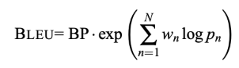

**Research on BLEU Metric for AAIE Project** 

**Overview:** 

BLEU stands for Bilingual Evaluation Understudy. It is an automatic metric originally designed for machine translation, but it has become a general tool for assessing the quality of any machine-generated text. BLEU answers the question: How much does my generated text look like the reference text? 

**Key Idea:** 

- **Matching  n-grams:** Divide  the  generated  sentence  and  the  reference sentence(s) into small pieces of length n (n-grams). For example, for n=1 we look at individual words; for n=2 we look at pairs of words.
- **Computing Precision:** Count how many of the generated n-grams appear anywhere in the reference(s) and divide by the total number of generated n-grams. This gives the modified precision for that n. 
- **Combine multiple lengths:** Repeat this** for n-grams of length 1 to any chosen upper limit and take the geometric mean of precisions.** 
- **Apply Penalty:** Short sentences tend to have high precision because of having fewer words, so *brevity penalty* is used to reduce generating overly short text.** 
- **Scoring:** A perfect match with reference gives a score close to 1 and poor match gives a score close to 0.** 

**BLEU Formula:** 

Where: 

- “p(n)” is the modified n-gram precision for length n. 
- “w(n)” are the weights for each precision. Taking the weighted and exponential sum results in geometric mean of n-gram precisions. 
- “BP” is brevity penalty, it will be 1 when the sentence is as long as reference, when shorter it decreases to 0. 

**Why using Geometric mean?** 

Using the geometric mean ensures that a low precision for any n-gram length will lower the overall score. This discourages systems that optimise only unigram precision and ignore longer structure, encouraging more fluent, phrase-level matches.  

**Why using BLEU for AAIE:** 

- BLEU  provides  a  quick  numerical  measure  of  how  closely  AI-generated feedback resembles feedback from educators. This helps in comparing models and tracking improvements.
- BLEU can be applied to any language by operating on tokens, making it suitable for multilingual educational contexts.
- Although developed for machine translation, BLEU’s n-gram matching principle works for summarisation and feedback generation, which are key tasks in the AAIE project. 

**Limitations of BLEU:** 

- BLEU may award a high score if the generated text matches lots of short phrases from the reference, even if it misses key ideas or omits some important points from the original.
- BLEU counts exact token matches; synonymous phrases may be penalised even if they convey the same meaning.
- Scores  vary  with  the  number  and  length  of  reference  texts;  using  more reference feedback typically increases BLEU.
- Without  the  brevity  penalty,  systems  might  generate  unnaturally  short responses that match a few key words.

**Where to use BLEU in AAIE:** 

- **During training:** Evaluate BLEU on a validation set of student answers paired with exemplar feedback. Plot BLEU over training epochs to monitor progress. 
- **Comparing  Models:**  When  experimenting  with  different  model  sizes  or fine-tuning strategies, BLEU helps identify which model matches educator style more closely. 

**Final Notes:** 

BLEU is useful for evaluating auto generated text by overlapping n-grams and brevity penalising. However, BLEU should be a part of suite of metrics that includes ROUGE, semantic metrics and human evaluation to make sure the student assessments is not only similar to reference texts but also comprehensive and accurate. 
