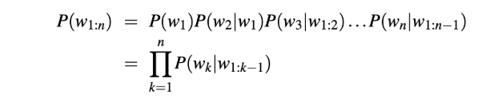
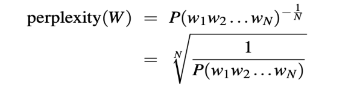

**Research on Perplexity metric for AAIE project** 

**Overview:** 

Perplexity is an intrinsic evaluation metric used in language modelling to measure how well a probabilistic model predicts a sequence of tokens. It is widely used to assess n-gram models and neural language models. In the AAIE project, perplexity helps evaluate the quality of custom mini-LLMs trained on synthetic educational data and can also assist in detecting AI-generated responses. 

**Definition:** 

Given a test sequence W=w1w2…w(N), the perplexity of a language model is defined as the inverse probability of the sequence, normalised by the number of tokens N: 

web.stanford.edu 

The formula shows that perplexity is the geometric mean of the inverse conditional probabilities  assigned  by  the  model. A  lower  perplexity  indicates  that  the  model assigns higher probability to the observed sequence and therefore is less “perplexed” when predicting the next token. 

**Explanation:** 

- Lower  perplexity  implies  the  model  is  more  confident  and  generally  more accurate at predicting sequences.** 
- Perplexity allows comparison of different language models on the same test set;  however,  comparisons  are  only  valid  when  the  vocabularies  and preprocessing are identical.** 
- The model can still make poor choices even though it has low perplexity. We should combine perplexity with BLEU scores for better translation quality.** 

**Relevance of Perplexity for AAIE:** 

- When AAIE’s Mini-LLM Prototyping & Training Team trains transformer models on synthetic instructional data, perplexity can be used to monitor learning progress and to compare different architectures or hyperparameter settings. Lower perplexity on held-out data usually indicates better language modelling capability. 
- AI-generated  responses  often  exhibit  lower  perplexity  because  large-scale LLMs are trained to maximise likelihood. Human writing tends to show higher perplexity  due  to  more  varied  vocabulary  and  structure  aijourn.com.  This property  can  be  used  as  a  feature  for  detecting  AI-generated  student submissions. 
- Perplexity  can  guide  the  choice  of  domain-specific  tokens  and  tokenizer settings.  High  perplexity  on  real  student  responses  may  indicate  that  the model’s vocabulary or training data lacks coverage of educational terminology. 

**Advantages:** 

- Provides a simple intrinsic measure of how well a model predicts tokens. 
- Easy to compute on large datasets. 
- Useful for model selection and debugging. 

**Limitations:** 

- Does not directly measure quality of generated feedback or rubric.
- We cannot compare the models with different vocabularies.
- Improvements may not reflect downstream task performance. 
- The model should be interpreted cautiously, a low perplexity on biased training data may produce unfair patterns. 

**Final Note:** 

- Use perplexity during training to detect over-fitting and to select checkpoints; plot perplexity across epochs and ensure it decreases on the validation set.
- For  AI  detection,  use  perplexity  alongside  other  stylometric  features (burstiness, lexical richness) to build robust detectors.
- Ensure  the  vocabulary  and  preprocessing  are  consistent  when  comparing perplexity across models.
