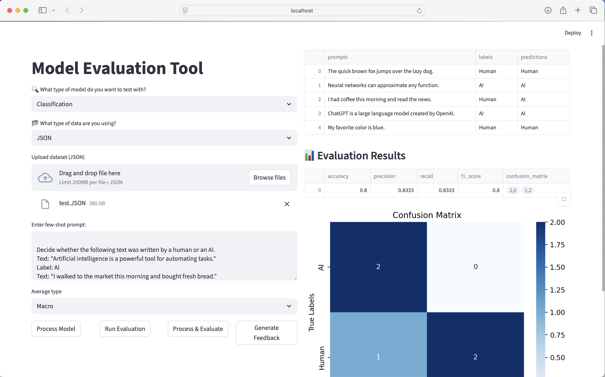
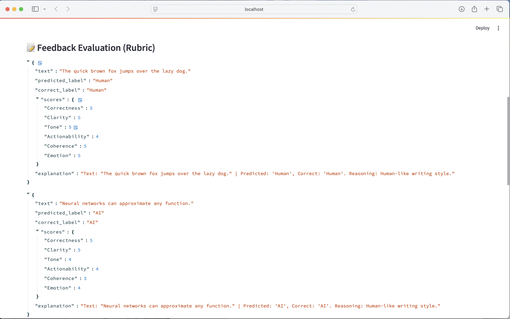

SIT378 – Project B
Project name: AAIE – LLM Prototyping and Training

 

Report: Interactive Model Evaluation Visualization
 

1.	Overview

This project implements an interactive visualization tool to evaluate both classification and Feedback Generation. The tool allows users to upload datasets, run model evaluations, and view results in a user-friendly interface built with Streamlit.

2.	Methodology:

2.1.	Model Evaluation Types

•	Classification: Evaluate models predicting discrete labels. Metrics include accuracy, precision, recall, F1-score, and confusion matrix visualization.
•	Generative: Evaluate text generation models using metrics such as BLEU, ROUGE, and BERTScore.

2.2.	Data Input Options

•	Simple Text: Enter text data manually (a few-shot prompt)).
•	JSON Dataset: Upload JSON files with structured data containing prompts, reference texts, predictions, or labels.

{
  "prompts": [
    "The quick brown fox jumps over the lazy dog.",
    "Neural networks can approximate any function.",
    "I had coffee this morning and read the news.",
    "ChatGPT is a large language model created by OpenAI.",
    "My favorite color is blue."
  ],
  "labels": ["Human", "AI", "Human", "AI", "Human"],
  "predictions": ["Human", "AI", "AI", "AI", "Human"]
}

2.3.	Few-Shot Prompt

•	Supports custom few-shot prompts to guide AI classification models.
•	Default examples are included for immediate testing.

2.4.	Interactive Dashboard

•	Built with Streamlit.
•	Includes: Dataset preview.
•	Evaluation results table.
•	Confusion matrix visualization for classification tasks.

3.	Run the Streamlit App

streamlit run app.py

4.	Evaluate Models

•	Select model type: Classification or Generative.
•	Choose data input type: Simple Text or JSON.
•	Upload your dataset or enter text manually.
•	Customize the few-shot prompt (optional).
•	Click buttons to:
o	Process Model: Convert uploaded data into internal DataFrame.
o	Run Evaluation: Evaluate model performance using selected metrics.
o	Process and Evaluate: Combine processing and evaluation in a single step.

5.	Visualization

•	Confusion matrix generated using Seaborn for classification tasks.
•	Results displayed in tables and interactive dashboards.

**Streamlit Output::**
 

 