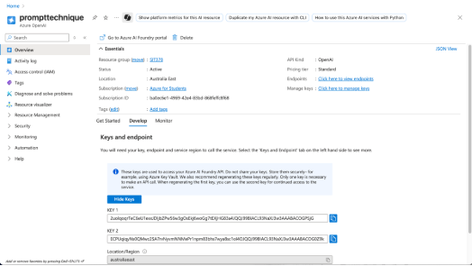
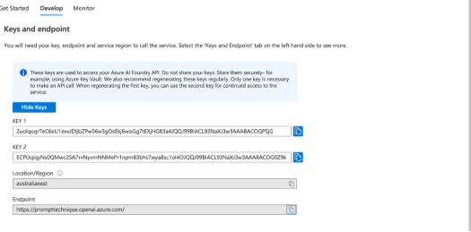
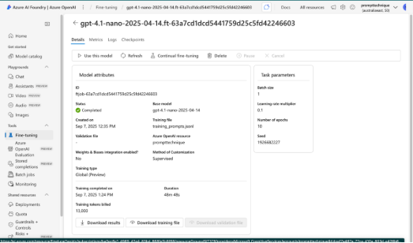
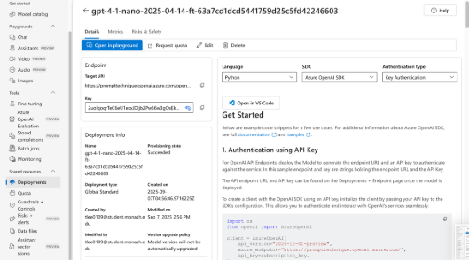
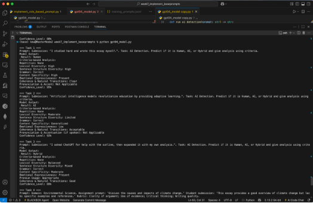
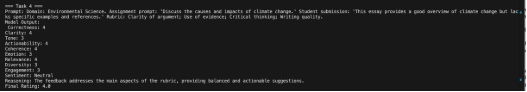
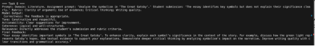

SIT378 – Project B

Project name: AAIE – LLM Prototyping and Training

-----

**Report: Implementing Role-Based Prompting with selected model (GPT-4.1) for AI Detection & Feedback Generation**

-----

1. **Overview**

   The implementation of role-based prompting using the GPT-4.1-nano model to perform

1) AI Detection Task: Classify student submissions as Human, AI, or Hybrid and justify based on linguistic criteria.
1) Feedback Generation Task: Generate structured academic feedback scored across six evaluation dimensions.

The goal was to test whether GPT-4.1 could reliably perform these roles when explicitly guided by structured role-based prompts using the evaluation criteria defined by our team.

1. **Microsoft Azure (Azure OpenAI) Set-up:**
   1. *Pre-requisites:*

      pip install openai==1.35.10

      pip install azure-identity

   1. *Create Azure OpenAI Resource:*

1. Go to the Azure Portal.
1. Click Create a Resource → Search for Azure OpenAI.
1. Fill in:
- Subscription: Azure Student
- Resource Group: create new group
- Region: (choose available region) Australia East
- Name: create a name for project
1. Create the resource.

   1. Deploy Open GPT-4.1 Model for deployment
1. Go to Explore Azure AI Foundry Portal
1. Navigate to Deployment: create new deployment
1. Choose model and upload the training dataset “training\_prompts.jsonl”
1. Create deployment to get deployment API for using: gpt-4-1-nano-2025-04-14-ft-63a7cd1dcd5441759d25c5fd42246603

1. **Implementation**

1. *Environment Set-up:*

- Selected Model: Open GPT-4-1-nano
- Fine-Tuning: Azure Open AI

  1. Azure Open AI Client Set-up:

endpoint = "https://prompttechnique.openai.azure.com/"

subscription\_key = "2uolqoqrTeC6eU1exxJDIjbZPw56w3gOsEkj6woGg7tEXjHG83a4JQQJ99BIACL93NaXJ3w3AAABACOGPSjG"

api\_version = "2024-12-01-preview"

deployment = "gpt-4-1-nano-2025-04-14-ft-63a7cd1dcd5441759d25c5fd42246603"

1. *Role-Based Prompting:*

1) **Role 1: Academic Integrity Evaluator (AI Detection):**
- Classify label the submission whether it is Human, AI, or Hybrid
- Rational: provide evidences, the reason such as grammar, cites, or lack of research.
- Explanation: provide full detail such as what student have and what they need to improve
- Flags: summary the key points (main keys)

1) **Role 2: Supportive Academic Assessor (Feedback Generation):**
- Score submission against 6 criteria (Correctness, Clarity, Tone, Actionability, Coherence, Emotion).
- Compute Overall Rating (average): show the rating from 1 to 5, such as excellent, good, average, need improvement, and poor
- Provide feedback text and reasoning for each score.

1. *Input Submission*
- Create Jsonl file for fine tuning with selected model (GPT4.1)

  {"messages": [{"role": "system", "content": "You are a careful academic assistant. Provide clear structured answers."}, {"role": "user", "content": "Give feedback: 'This essay provides a good overview of climate change but lacks examples.'"}, {"role": "assistant", "content": "The essay has a strong overview. To improve, include specific examples (e.g., rising sea levels, extreme weather) and cite references to strengthen credibility."}]}

1. **AI Detection Output**

   1. *Output:*

      

   1. *Observation:*

- Accuracy of Classification: The model demonstrates good differentiation across Human, AI, and Hybrid categories.
- Criteria Usefulness: Features like lexical diversity, emotional expressiveness, and content specificity provide strong rationale for each classification.
- Confidence Levels: High confidence (92–95%) across outputs suggests stability in predictions.
- Improvement Areas: provide longer explanations and rationale beyond the criteria list.

1. **Feedback Generation Output**

   1. *Output:*

`		`**

`	`**

1. *Observation:*

- Consistency Across Domains: The model adapts well to both scientific writing (structured, rubric-driven feedback) and literature analysis (interpretive, evidence-driven feedback).
- Balanced scoring in task 4 prompt.
- Constructive tone and actionable suggestions in task 8.
- Improvement: include specific content recommendations (such as cite IPCC reports, case studies), and provide a numerical breakdown for consistency.
