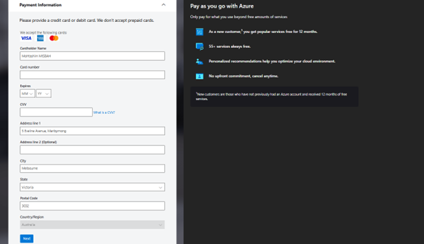

# Getting Started with Azure AI
### A Student Guide to Free Credits, API Keys, and Model Fine-Tuning  
**Author: Arnav Ahuja (223271095)**

## Introduction
Azure AI is Microsoft’s cloud-based platform that provides access to a wide range of artificial intelligence services and large language models (LLMs). It enables students, researchers, and developers to experiment with state-of-the-art commercial models, such as OpenAI’s GPT, Meta’s Llama, Mistral, DeepSeek, Phi, and even fine-tuned models without needing to invest in expensive infrastructure.
As a student at Deakin University, we can take advantage of the Azure for Students program, which grants USD $200 in free credits. These credits can be used to deploy and test AI models, retrieve API keys, and even fine-tune models when supported.
This document provides a step-by-step guide to:
•	Logging into Azure AI using your student account  
•	Redeeming your $200 free credits  
•	Accessing and managing API keys for popular commercial models  
•	Understanding how to fine-tune models within Azure AI (covered in more detail via a future video tutorial)  

## Why Use Azure AI?
One of the main challenges in working with LLMs is the need for significant compute resources and stable environments. Traditionally, this means setting up complex environments, managing GPUs, and handling compatibility issues manually.
With Azure AI, these issues can be greatly reduced:  
•	Free Student Credits: Students get USD $200 in credits upon sign-up, which can be used for deploying and testing AI models.  
•	Free API Keys: The credits allow you to obtain production-ready API keys for popular models such as GPT, Llama, Mistral, Phi, DeepSeek, and more.  
•	No Local Setup Required: There is no need to build or configure a heavy environment locally; models can be run directly from Azure endpoints. This solves the issue raised by PO.  
•	Fine-Tuning Made Easy: With Azure, fine-tuning workflows can be initiated without maintaining GPU clusters, saving time and avoiding infrastructure management.  
•	Alternative to GCP: This also solves the earlier limitation with Google Cloud Platform (GCP) resources, since Azure provides a ready-to-use cloud environment with more flexible access for students.  
In short, Azure AI eliminates infrastructure overhead and lets you focus directly on experimenting with and fine-tuning models, making it ideal for both research and project work.  

## Walkthrough Guide
The walkthrough is illustrated with screenshots for the ChatGPT and DeepSeek model setup and API key retrieval, which can be similarly applied to other supported models.

### Step 1: Go to the Azure Homepage
Navigate to the official Microsoft Azure homepage. In the top-right corner, you will find the Sign in button.  
→ Click on “Sign in” to proceed with your student account login.  
This will redirect you to the Microsoft login page where you can use your university email ID (student account) to continue.  

### Step 2: Pick Your Student Account
After clicking Sign in, you will be directed to the Microsoft login screen. Here you will see a list of accounts already signed in on your device.  
→ Select your university email ID to continue.  
•	If your student email is not listed, click “Use another account” and manually enter your student login credentials.  
This ensures that Azure recognizes your student eligibility for the 200 USD credit.  

### Step 3: Start with Azure Free Credits
After signing in, you will land on the Welcome to Azure page. Here, several options are shown, but the most important one is:  
•	Start with an Azure free trial – Get $200 free credit toward Azure products and services.  
→ Click on the Start button under this option.  
This step ensures your account is ready to use free resources instead of relying on local setups or paid subscriptions.  

### Step 4: Add Your Personal Details and Accept Agreement
At this stage, Azure will ask you to provide some personal details and accept the Microsoft Customer Agreement.  
•	Fill in the required information (like name, address, email and phone number).  
•	Tick the checkboxes to agree to Microsoft’s terms and conditions.  
→ Once all details are completed and required boxes are checked, click on Sign up to continue.  
This step finalizes the activation of your student account credits and prepares your Azure dashboard for use.  

### Step 5: Enter Payment Information
Even though you are signing up with a student account to get free credits, Azure still asks for basic payment information to verify your identity.  
1.	Fill in the required details:  
o	Cardholder Name  
o	Card Number, Expiry, and CVV  
o	Billing Address  
2.	After filling in the details, click Next.  
Note: You will not be charged for using the $200 free student credits. The card is only used for verification, and charges will only occur if you exceed your free credit or move to a paid plan.  

### Step 6: Search for Azure OpenAI
Once your account setup is complete and you’re on the Azure portal dashboard, you can now search for the services you want to use.  
•	In the search bar at the top of the portal, type “OpenAI”.  
→ Select Azure OpenAI from the list under Services.  
This will allow you to create a resource for using GPT models and generate the API keys needed to connect with your applications.  

### Step 7: Create a New Azure OpenAI Resource
After selecting Azure OpenAI from the search results, you’ll be taken to the AI Foundry - Azure OpenAI section.  
•	Here, you can view all existing resources linked to your account.  
•	Since this is likely your first time using Azure OpenAI, your resource list may be empty.  
→ Click on the “+ Create” button at the top to set up a new Azure OpenAI resource.  
This resource will act as the base for generating your API keys and managing model deployments (e.g., GPT, Llama, Mistral, Phi, DeepSeek).  

### Step 8: Configure Azure OpenAI Resource
Now you’ll be prompted to fill in the basic details for your new Azure OpenAI resource.  
1.	Subscription – Select your subscription from the dropdown list (e.g., Azure subscription 1).  
2.	Resource Group – Click Create new, then give it a name (e.g., AAIE). This helps organize your resources.  
3.	Region – Set the region to East US (recommended for availability and compatibility).  
4.	Name – Enter a unique name for your resource.  
5.	Pricing Tier – Keep the default as Standard S0.  
→ Once all fields are filled, click Next to continue.  
This step ensures your Azure OpenAI resource is properly set up and ready for deployment.  

### Step 9: Configure Network Access
Next, you will be asked to set network security options for your Azure OpenAI resource.  
•	All networks, including the internet, can access this resource – Recommended for most users, especially during setup and testing.  
•	Selected networks – Lets you restrict access to specific networks/IPs only.  
•	Disabled – Blocks all networks; only private endpoint connections can access the resource.  
→ For simplicity, select All networks and click Next.  
This ensures your resource can be accessed without restrictions, making it easier to start generating API keys and connecting with your applications.  

### Step 10: Tags (Optional)
You will now see the Tags section. Tags are simply name/value pairs used to categorize resources (for example, by project, team, or cost centre).  
→ Since this step is optional, you can skip it and directly click Next.  
This will take you to the Review + Submit page to finalize your resource creation.  

### Step 11: Review and Create Resource
At the final stage, you’ll see the Review + Submit page. This screen shows a summary of all your selections.  
→ Since you’ve carefully followed the steps, there’s nothing to change here. Simply click on the Create button.  
Azure will now begin deploying your resource. This usually takes 1–2 minutes. Once complete, your new Azure OpenAI resource will be ready for use.  

### Step 12: Access the Resource Overview
Once your Azure OpenAI resource has been successfully created, click on it to open the Overview page.  
→ To proceed, click the Explore Azure AI Foundry portal button.  
This will take you into the Azure AI Foundry, where you can:  
•	Access API endpoints  
•	Generate API keys  
•	Configure and deploy the models (GPT, Llama, Mistral, Phi, etc.) that you want to use  

### Step 13: Deploy OpenAI Model
#### Step 13.1: Navigate to Deployments
After your resource is created, you’ll land on the Home page inside the Azure AI Foundry portal. Here, you can see all the general details of your resource.  
On the left sidebar, you’ll notice many options such as Chat, Audio, Images, Fine-tuning, Batch Jobs, and more. (We will explore fine-tuning later in a separate guide.)  
→ For now, scroll down the menu and select the Deployments section.  
This is where you can deploy a specific model (like GPT, Llama, Mistral, etc.) and generate an API key + endpoint for use in your applications.  

#### Step 13.2: Deploy a Model
When you open the Deployments section, you’ll see a list of models that are already deployed.  
•	In this example, one model (gpt-4.1) is already deployed.  
•	For a new account, this list will be empty.  
→ To create your first deployment, click the + Deploy model button at the top.  
This will let you choose which model you want to deploy (e.g., GPT, Llama, Mistral, Phi, DeepSeek, etc.) and set it up so that you can later grab its API endpoint and key for use in your projects.  

#### Step 13.3: Choose Deployment Type
When you click the + Deploy model button, you’ll be presented with two options:  
•	Deploy base model – Use a pre-trained model as it is (recommended for now).  
•	Deploy fine-tuned model – Use a custom version of a model that you have fine-tuned (we will cover this later in a separate guide).  
→ For now, select Deploy base model, since we are only working with standard pre-trained models.  
This will take you to the model selection screen where you can pick from the available models (e.g., GPT-4.1, GPT-3.5, etc.).  

#### Step 13.4: Select a Model
You’ll now see the model catalog, which contains a wide range of models (in this example, 42 models are available).  
•	Browse through the list to find the model you want.  
•	Each model will include details such as its task type (e.g., Chat completion, Audio generation, etc.) and a description.  
→ Select your desired model. In this example, gpt-4o has been chosen.  
Once you’ve made your selection, click Confirm to proceed. This will prepare the model for deployment under your Azure OpenAI resource.  

#### Step 13.5: Finalize Deployment
After selecting your model, you’ll be asked to configure the deployment settings:  
1.	Deployment name – A default name (e.g., gpt-4o) will be suggested. You can keep it or choose your own.  
2.	Deployment type – Leave this as Global Standard (recommended). This option ensures your deployment has the highest rate limits and works globally.  
3.	Deployment details – Review the model version, location, and capacity (e.g., 50K tokens per minute). No changes are needed here for now.  
→ Once everything looks correct, click Deploy.  
Azure will now set up the model deployment. This usually takes a few minutes, after which your model will be ready to use with an endpoint and API key.  

#### Step 13.6: Retrieve API Endpoint and Key
Once your model deployment is complete, you’ll see the Deployment Details page.  
Here, Azure shows you:  
•	The Endpoint (Target URI) – this is the base URL you’ll use to send requests.  
•	The API Key – a secure key needed to authenticate requests.  
→ Copy these details when integrating the model into your application.  
Important: Never share your API keys publicly. Keep them secure (for example, in environment variables or a secrets manager).  
With the API key and endpoint, you’re now ready to start making API calls to your deployed model.  

#### Step 13.7: Test with a Basic Code Sample
Azure provides a sample code snippet that you can directly use to test your deployed model.  
→ You can copy this code into a Google Colab notebook or Jupyter Notebook and replace <your-api-key> with your actual API key.  
This allows you to run a simple request to verify that your deployment works and that you can successfully interact with the model.  

### Step 14: Deploy other models (DeepSeek)
#### Step 14.1: Manage or Create New Resources
On the left-hand side menu, at the very top, you’ll see the current resource you’re working in.  
→ Click on the resource name to open a dropdown menu showing all your recent resources.  
From here you can:  
•	Switch between existing resources (e.g., different projects, subscriptions, or regions).  
•	Or, if you need to start fresh, select Create new to add another Azure OpenAI resource.  
This is useful when you want to test different models, manage multiple projects, or separate workloads by resource group.  

#### Step 14.2: Create a New Resource (AI Hub)
When you click Create new from the resource dropdown, you’ll be asked to choose a resource type.  
Two options are available:  
•	Azure AI Foundry resource – for managing OpenAI models, agents, and tools.  
•	AI Hub resource – for more advanced scenarios, such as accessing models beyond OpenAI (e.g., Llama, Mistral, Phi, DeepSeek), as well as custom ML training and fine-tuning.  
→ To expand your access to non-OpenAI models, select AI hub resource and click Next.  
This will allow you to use a broader set of commercial and open-source models, not just GPT-based ones.  

#### Step 14.3: Finalize New Project Creation
When setting up a new AI Hub resource, you’ll need to provide some basic details:  
1.	Project name – Enter any name you prefer for the project.  
2.	Hub – A default hub name will be generated automatically, but you can rename it if needed.  
3.	Advanced options – By default, Azure selects optimal settings (e.g., region and defaults) for your project. You can leave these as they are.  
→ Once done, click Create.  
Azure will now set up your new project. This may take a moment, after which you’ll have a new resource available to access additional models and tools.  

#### Step 14.4: Explore Models in Your New Resource
Once your new AI Hub resource has been created, you can switch to it using the dropdown at the top.  
Inside the Model catalog section, you’ll now see a wide range of models available for deployment — not only OpenAI ones, but also others such as DeepSeek, Grok, Mistral, Phi, and more.  
→ From here, you can browse and search through all available models, deploy the ones you need (just like we did earlier with GPT) and later, fine-tune or experiment with additional features such as Agents, Templates, and Content Understanding.  
This flexibility allows you to work with both OpenAI and non-OpenAI models, making Azure AI Hub a powerful choice for diverse projects.  

#### Step 14.5: Select and Use the Models (Example: DeepSeek)
When you select a model from the Model catalog (in this case, DeepSeek-R1-0528), you’ll be taken to its details page.  
•	You can also fine-tune it (if supported) by selecting Fine-tune.  
→ To proceed, click Use this model to begin deployment, just like we did earlier with GPT models.  
This means you’re not limited to OpenAI models — you can explore and deploy cutting-edge alternatives like DeepSeek, Grok, Phi, Mistral, Sora, and more directly from Azure AI Hub.  
Click “Use this model” button to deploy it and get access to your API key.  

#### Step 14.6: Deploying DeepSeek
After selecting Use this model, you’ll be taken to the deployment configuration page.  
•	Deployment name – Defaults to the model name (you can leave it as is).  
•	Deployment type – Keep this set to Global Standard.  
•	Deployment details – Includes model version, authentication type, content safety, and region. No changes are needed.  
→ Simply click Connect and deploy to start deployment.  
This process is the same as with OpenAI models, once deployed, you’ll receive an endpoint and API key that you can use in your applications.  

#### Step 14.7: Retrieve API Endpoint and Key
Once the deployment is successful, you’ll land on the Deployment details page.  
Here you will find:  
•	Target URI (Endpoint) – the unique URL for calling your deployed model.  
•	Authentication type & API Key – used to securely access the model.  
•	Deployment info – confirmation that your deployment succeeded and is active.  
→ Copy your API Key and Endpoint. These are what you’ll use in your code to interact with the model (whether GPT, DeepSeek, Grok, Mistral, or others).  
Important: Keep your API key private — never share it publicly. Use environment variables or a secrets manager in production.  

#### Step 14.8: Test with a Basic Code Sample
Azure provides a sample code snippet that you can directly use to test your deployed model.  
→ You can copy this code into a Google Colab notebook or Jupyter Notebook and replace <your-api-key> with your actual API key.  
This allows you to run a simple request to verify that your deployment works and that you can successfully interact with the model.  

## Tutorial Link
https://deakin.au.panopto.com/Panopto/Pages/Viewer.aspx?id=74b7ed26-a8a3-4226-8631-b34000a17d82

## Conclusion
With the resources and deployments now set up, you have access to powerful APIs for models such as GPT, DeepSeek, Grok, Mistral, and more. This is already valuable for prompt engineering workflows, since it allows you to experiment with different models and quickly grab API keys for integration. The setup also ensures that your team can test models directly inside Colab or Jupyter and move seamlessly from exploration to production.  
The natural next step is to go beyond base models and begin exploring fine-tuning. Fine-tuning will allow us to customize models for specific datasets or tasks, improve performance in niche domains, and build LLMs that are optimized for AAIE.  
While this document focused on getting access and deploying models, the next one will walk through dataset preparation, uploading and managing data in Azure AI Foundry, running fine-tuning jobs, and deploying fine-tuned models.  
For now, this workflow gives you the foundation you need: logging in with student credits, creating resources in both Azure OpenAI and AI Hub, deploying base models, and securely retrieving endpoints and API keys. This will be helpful not only in prompt engineering, where different prompt strategies can be tested directly against live APIs, but also for the data team, who can build and refine fine-tuned models when required.  
