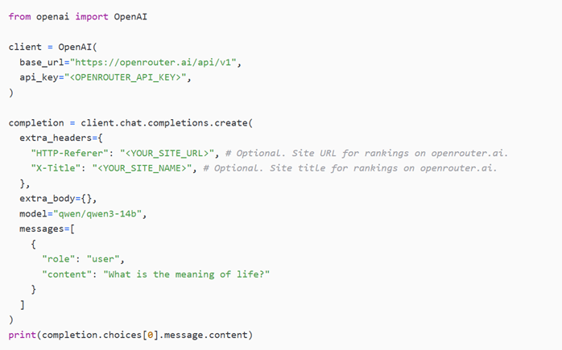

# Getting Started with OpenRouter
### A Guide to Accessing APIs for Open-Source Models for Free

## Introduction
OpenRouter is a platform that provides unified access to a wide range of open-source and commercial large language models (LLMs) through a single API. Instead of managing multiple deployments or setting up heavy local environments, OpenRouter allows developers, students, and researchers to test and integrate models such as Llama, Mistral, DeepSeek, Grok, Phi, and many more from one place.  
For projects where finding reliable deployment sources is a challenge, OpenRouter offers a lightweight and straightforward alternative. APIs can be tested directly in notebooks (e.g., Colab or Jupyter) without the overhead of provisioning GPUs or managing cloud infrastructure. This makes it especially useful in contexts where local environments are laggy, or accessing models from Hugging Face requires complex hosting steps.  

In this document, we will provide a step-by-step walkthrough (with screenshots) on how to:  
•	Create an OpenRouter account.  
•	Retrieve and secure your API key.  
•	Select and test models through the OpenRouter interface.  
•	Integrate these APIs into your prompt engineering and experimentation workflows.  

## Why Use OpenRouter?
In our project AAIE, a recurring limitation has been the difficulty of getting a deployment platform for our models. Azure AI solves part of this by offering some commercial models, but there are gaps when it comes to lightweight access to open-source models.  

OpenRouter addresses these issues by:  
•	Aggregated Access: One platform with dozens of models, from both open-source (e.g., Llama, Mistral) and commercial providers.  
•	No Local Setup: Eliminates the need to configure GPU environments or host Hugging Face models yourself.  
•	Cheaper Paid Models: For commercial models, OpenRouter often offers significantly lower pricing. For example, accessing ChatGPT via OpenRouter is usually around 1/5th the cost per token compared to using the direct OpenAI API, making it a cost-effective alternative for sustained experimentation.  
•	Prompt Engineering Ready: Provides a single, consistent API interface to quickly test prompts across different model families.  
•	Fills the GCP Gap: Avoids the resource limitations faced in GCP or AWS, since no deployment is required.  
•	Quick API Key Setup: Keys can be generated instantly without credit card verification or student eligibility checks.  

For our use case, OpenRouter offers a practical, low-barrier entry point to explore models while keeping experimentation flexible and lightweight.  

## Limitations of OpenRouter
While OpenRouter is very convenient, there are some constraints to be aware of:  
•	Commercial Models are Paid: Most advanced commercial models (like GPT-4 or Claude) require payment by adding credits to the account.  
•	Low Free Quota: Free access is capped at 50 API calls per day, which can be restrictive for heavier experimentation.  
•	Token Limits: Some models have stricter input/output token limits, making them less suitable for large dataset processing or long-form experimentation.  
•	Not Ideal for Scaling: For production or large-scale testing, OpenRouter can become cost-intensive compared to deploying on Azure or custom infrastructure.  

Despite these limitations, OpenRouter is an excellent sandbox environment for prompt engineering, rapid testing, and lightweight prototyping, especially where laggy local setups or Hugging Face hosting issues would otherwise slow down experimentation.  

## Walkthrough Guide

### Step 1: Create / sign in to an OpenRouter account
1.	Go to openrouter.ai and Sign in.  
2.	Pick a method: GitHub, Google, Passkey, MetaMask, or email.  
3.	Accept the Terms of Service and Privacy Policy when prompted.  

### Step 2: Browse and choose a model
1.	Open Models in the top nav.  
2.	Use filters (modality, context length, price) as needed.  
3.	Click a model to view its page—for this tutorial choose Qwen: Qwen3 14B.  
   o	Note the model ID shown near the title. For Qwen3-14B it is typically qwen/qwen3-14b.  
4.	On the model page, switch to the API tab. This tab shows usage examples.  

### Step 3: Create an API key
1.	On the API tab, click Create API key.  
2.	Give the key a Name (e.g., aaie).  
3.	(Optional) Set a Credit limit to cap spend.  
4.	Click Create and copy the key (it starts with sk-or-...).  
5.	Store it safely (password manager / secrets store). For local dev, add to .env:  
   `OPENROUTER_API_KEY=sk-or-...`  

**Key hygiene tips**  
•	Never commit keys to Git.  
•	Use separate keys per environment (dev/staging/prod).  
•	Revoke/rotate any leaked keys immediately.  

### Step 4: Make your first request
OpenRouter is OpenAI-compatible. You point the SDK to the OpenRouter base URL and use the model ID you selected.  

### Step 5: Useful options & next steps
•	Change models: swap model to any ID shown on that model’s page.  
•	Temperature / max tokens: tune temperature, top_p, and max_tokens like the OpenAI API.  
•	Streaming: add stream=True (Python) or stream: true (Node) and read chunks as they arrive.  
•	Tool use / function calling: supported by many models using the standard OpenAI JSON schema.  
•	Vision / images / audio: choose a model that supports the modality and follow its API notes.  
•	Usage & uptime: model pages include Activity and Uptime tabs; your account shows usage and keys.  

### Step 6: Common pitfalls (quick fixes)
•	401 Unauthorized: bad/missing key; ensure header is Authorization: Bearer sk-or-... and correct base URL.  
•	404 Model not found: double-check the model ID from the model page.  
•	429 Rate limit: slow down, add retries with exponential backoff.  
•	Costs higher than expected: set a credit limit when creating keys; log token usage; prefer cheaper models for bulk.  

### Step 7: Clean-up / rotate
•	To rotate or delete a key, return to API Keys in your OpenRouter account, revoke the old key, create a new one, and update your environment secrets.  

## Conclusion
For the AAIE project, OpenRouter offers a particularly valuable solution to the recurring challenges our team has faced with model deployment and experimentation. In the past, access to diverse large language models has been limited by infrastructure constraints, laggy local environments, or the overhead of provisioning GPUs through cloud platforms like GCP and AWS. By consolidating multiple open-source and commercial models under a single API, OpenRouter provides our team with a lightweight, cost-effective, and highly flexible way to test prompts, validate ideas, and benchmark different model families without investing time and resources into heavy setup.  

This is especially relevant to AAIE’s focus on prompt engineering and few-shot learning workflows, where rapid iteration across models such as Llama, Mistral, or Qwen can significantly accelerate experimentation. The ability to generate API keys instantly, enforce spending caps, and swap models with minimal code changes makes OpenRouter an ideal sandbox for prototyping before scaling up to production environments. Moreover, its OpenAI-compatible interface ensures smooth integration into the pipelines and evaluation frameworks that the AAIE team is already building.  

While limitations such as capped free calls and token restrictions must be factored into our planning, these can be managed effectively through credit limits and careful workload distribution. In this way, OpenRouter serves as both a practical bridge—filling the gaps where other providers fall short and a strategic enabler for the AAIE project. It allows us to focus on designing robust evaluation methods, testing detection and feedback prompts, and building innovative workflows, without being slowed down by infrastructure bottlenecks. Ultimately, incorporating OpenRouter into AAIE ensures that our team can move forward with agility, confidence, and access to the latest developments in open-source and commercial LLMs.
