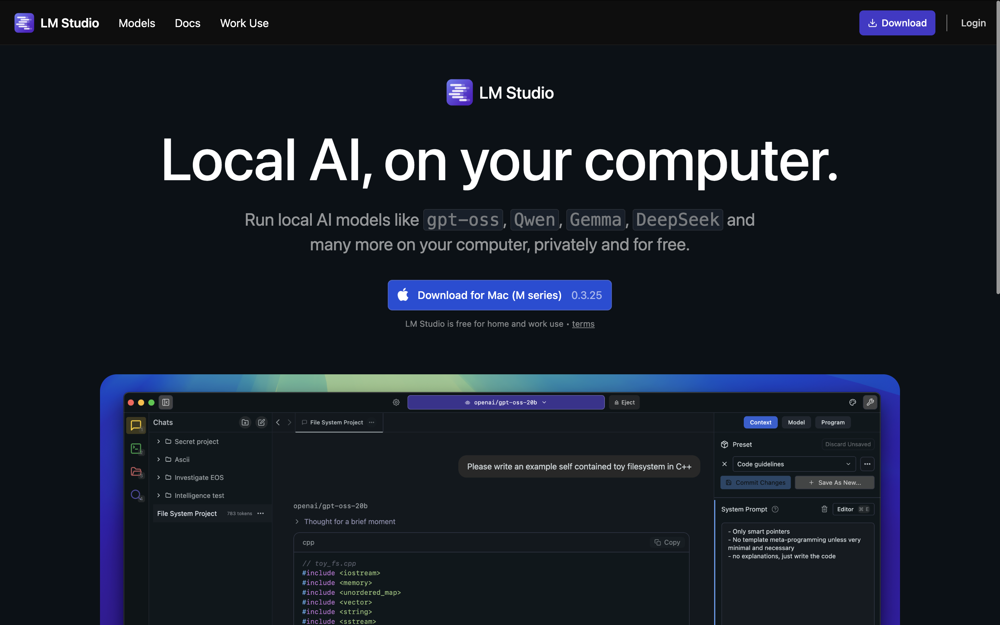
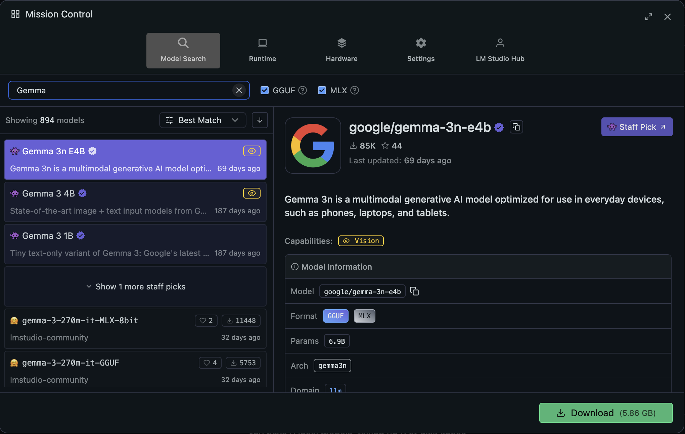
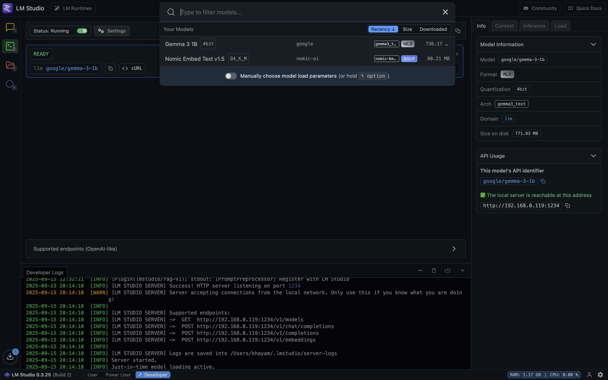
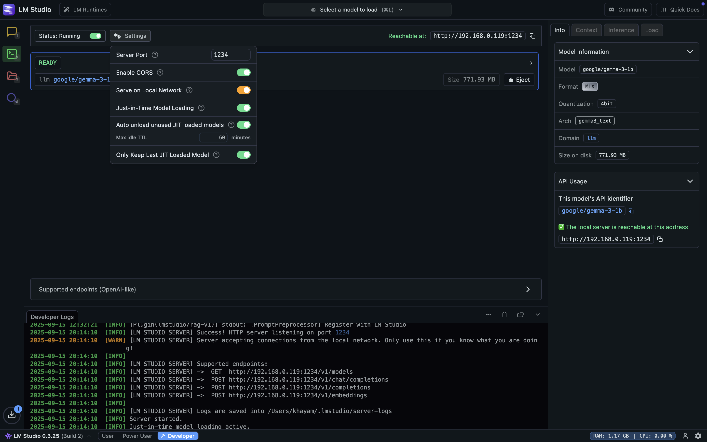

## 1. LM Studio
LMStudio is designed to download and run open-source models (like Gemma, Qwen, Llama, Phi, etc.) on your own computer locally. The best thing about LM Studio is that it creates a local web server that mimics the API structure of a commercial service, specifically the OpenAI API. This means you can use the same code and tools you would use for GPT-4 to interact with a model running on your own machine, by just changing the API endpoint URL.

## 2. Setup Process
### 2.1 Download and Install LM Studio
- Navigate to the official LM Studio website: [https://lmstudio.ai/](https://lmstudio.ai/)  
- Download the version for your operating system (Windows, macOS, or Linux) and install it. Below is an example for macOS.

  
### 2.2 Find and Download an AI Model
- Open LM Studio.
- Use the search bar to find a model you want.  For example, check the image below to search for the Gemma model.

- Click on the required model and then click the download button at the bottom right.

### 2.3 Start the Local API Server
LM Studio only starts the local API server after you select a model and click Start Server. If you try calling the API before doing this, you will get connection errors (e.g., 502 or 404.
- Select the model you want to use from the list of downloaded models.  
- Click on the model like Gemma 3 1 B.  

- Review the server settings on the left (default Host: localhost, Port: 1234 are usually fine).
- Click Start Server.

- Once started, you will see server logs, and the button will change to Stop Server. Your local, OpenAI-compatible API is now running and ready to receive requests.

## 3. LM Studio API Endpoints
LM Studio runs locally and does not require an API key to use its API. The default base URL is http://localhost:1234/. The API has no authentication, so you should not expose it beyond localhost unless you understand the security risks. If you want to access LM Studio from another computer on your network, you must configure it to bind to your LAN IP address.
LM Studio exposes a local API that mimics commercial AI services. Below are the main endpoints:

### 1. GET http://localhost:1234/v1/models
- Retrieves a list of the models currently loaded and available.
- Useful for checking which model is active before sending a request.
- Returns a JSON object containing the model's identifier.

### 2. POST http://localhost:1234/v1/chat/completions
- Primary endpoint for generating text in a conversational format.
- Requires a JSON payload with a messages array.
- Each object in messages has:
  - role (system, user, assistant)
  - content (text)
- The model responds with the next message based on the conversation context.

### 3. POST http://localhost:1234/v1/completions
- Generates text from a single prompt.
- Requires a JSON payload with a prompt key containing your text.
- Best for one-off tasks like summarization or headline generation.
- 
### 4. POST http://localhost:1234/v1/embeddings
- Converts one or more text strings into numerical vector representations (embeddings).
- Requires a JSON payload with an input key containing a string or an array of strings.
- Returns a high-dimensional vector for each input string.

## 4. Key Features
- **Local Model Hosting**: Run models like Gemma, Qwen, LLaMA, Phi directly on your machine.
- **API Compatibility**: Mimics the OpenAI API, allowing easy integration with existing GPT-based tools.
- **Offline Operation**: Works without internet, great for sensitive data or limited connectivity.
- **Flexibility & Customization**: Experiment with models and parameters locally.
- **Ease of Integration**: Plug into existing applications without major code changes.
- 
## 5. Limitations
- **Resource Intensive**: Running LLMs locally typically requires 8 – 16 + GB of RAM (minimum) and benefits greatly from a GPU with sufficient VRAM for faster inference.
- **Performance**: Slower inference compared to commercial cloud APIs unless using powerful hardware.
- **Single-User Focus**: Not optimized for high-concurrency production workloads.
- **No Commercial Support**: Relies on community forums for troubleshooting and updates.
