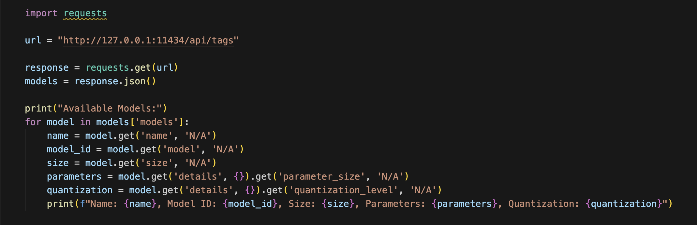

## 1. Ollama
Ollama is designed to easily download and run open-source models (like Llama, Gemma, Phi, Mistral, etc.) on your own computer locally. The key strength of Ollama is its simplicity; it runs models as background services with a single command. Like LM Studio, Ollama provides an OpenAI-compatible local API endpoint, which means you can use the same code you would use for GPT-4 by just switching the API URL.

## 2. Setup Process
### 2.1 Download and Install Ollama
- Navigate to the official GitHub repo of Ollama: [https://github.com/ollama/ollama](https://github.com/ollama/ollama).
- Clone it into your local device
- You can also download the Ollama application onto your device for your operating system, but that will be only for chatting, not for developers. 

### 2.2 Find and Install an AI model
- Open a terminal or command prompt.
- Open GitHub and find which model you want to download, then run, for example, for Gemma3, run "ollama pull gemma3"
- Once downloaded you can run by simply running this command "ollama run gemma3"

### 2.3 Start the Local API Server
- To run the server, you need to be inside the Ollama Folder, the one you have cloned
- Then run the "go run . server" command in the terminal
- Your local API will be like "http://127.0.0.1:11434"
- You can test how the available model by running the below code

## 3. Ollama API Endpoints
### 3.1 Get http://127.0.0.1:11434/api/tags
- Returns a list of available models.
- Useful to confirm which models are downloaded and ready to use.

### 3.2 Post http://127.0.0.1:11434/v1/chat/completions
- Primary endpoint for chat-based conversations.
- Accepts a JSON payload with a messages array (role + content).
- The model responds with the next message in context.

### 3.3 Post http://127.0.0.1:11434/v1/completions
- Generates text from a single prompt (non-chat use case).
- Good for summarization, extraction, or one-shot tasks.

### 3.4 POST http://localhost:11434/v1/embeddings
- Converts text into numerical vector embeddings.
- Useful for semantic search, clustering, or retrieval-augmented generation.

### 3.5 Get http://localhost:11434//api/version
- Returns the current version of Ollama running on your machine.
- Useful for debugging or confirming compatibility.

## 4. Key Features
- **Simple CLI + API:** Easy to pull, run, and manage models with a single command.
- **Local Hosting:** Run models like Llama, Mistral, Gemma, or Phi entirely offline.
- **API Compatibility:** Works with OpenAI-style API calls, so you can reuse existing GPT-based code.
- **Cross-Platform:** Works on macOS, Windows, and Linux with minimal setup.
- **Lightweight & Flexible:** Automatically handles model serving in the background.

## 5. Limitations
- **Resource Demands:** Like LM Studio, large models need significant RAM and GPU VRAM for good performance.
- **Limited UI:** Ollama is CLI-first and does not include a graphical interface like LM Studio.
- **Concurrency:** Best for single-user, local experimentation and not optimized for production scale.
- **Community-Driven:** Relies on documentation and open-source contributions for support.
