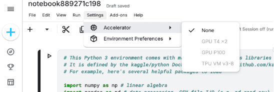
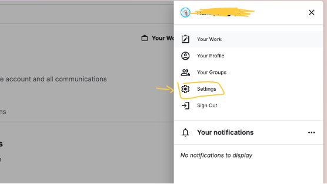
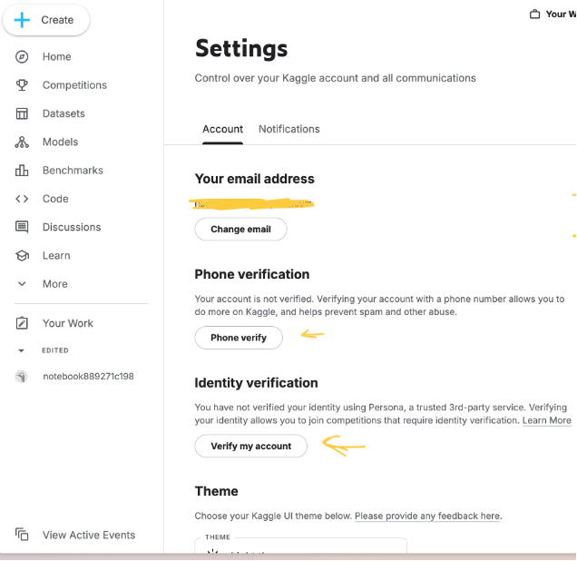
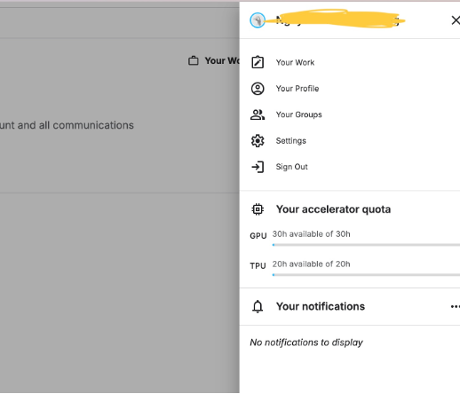
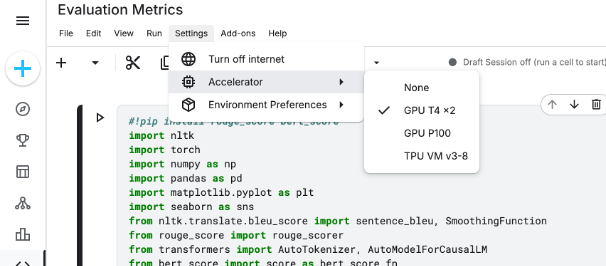
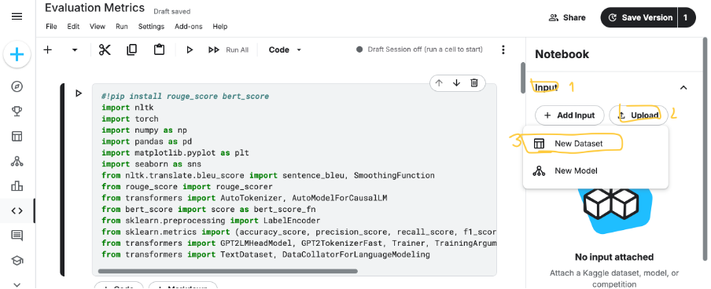
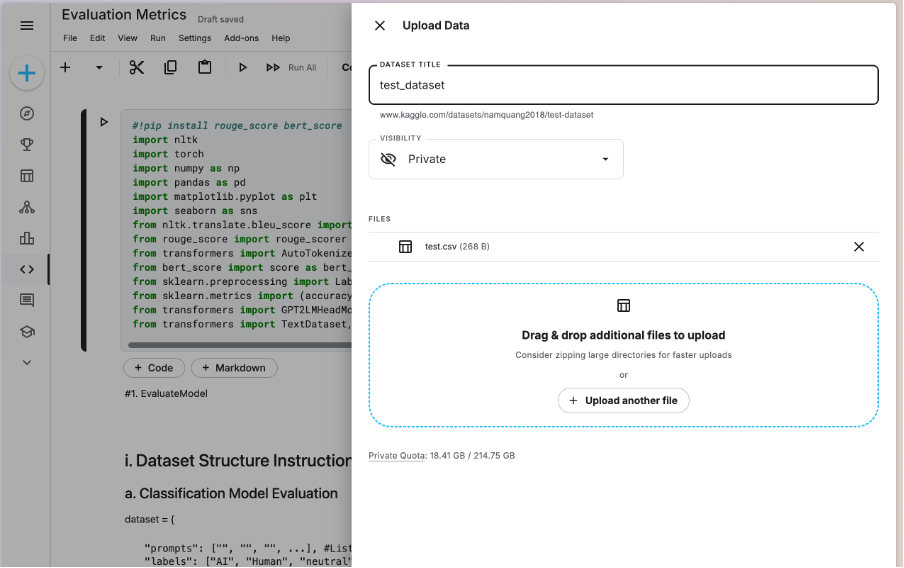
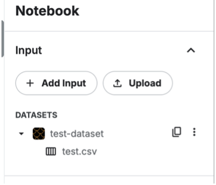

1. Introduction to Kaggle GPU

Kaggle provides free access to powerful GPUs (Graphics Processing Units) that can significantly speed up machine learning and deep learning tasks. Instead of relying on local hardware, you can run notebooks on Kaggle’s cloud environment with GPUs such as NVIDIA Tesla T4 or P100. This makes it easier to train large models, handle big datasets, and experiment with deep learning frameworks like TensorFlow and PyTorch. Kaggle GPUs are especially useful for students, researchers, and practitioners who want to prototype and test models quickly without needing expensive hardware. Kaggle’s cloud environment provided with GPUs such as NVIDIA Tesla T4 or P100.

NVIDIA Tesla T4
- A more modern and efficient GPU.
- Optimized for both training and inference.
- Has Tensor Cores, making it faster for deep learning tasks like image recognition and NLP.
- Generally better for everyday model development than the K80.

NVIDIA Tesla P100
- A high-performance GPU.
- Strong at heavy training workloads.
- Faster and more powerful than T4 for raw training speed.
- Very useful when working with large neural networks and datasets.

However, in order to use this, we need to verify the account!!!

1. How to activate Kaggle GPU

At first, once we create a Kaggle account, we still not able to get access to the GPU resource as, if we try to access we might found these resources is disable:

In order to get access to the GPU resource, we have to verify the account, I will show you how to verify this after create an account:

- Step 1: Create an account

- Step 2: Once you have created a new account, head to the top right corner which have your avatar and choose Setting.

- Step 3: Go to the Identity verification and Phone verification,  and start verify by allow it to scan through your face.

Once you have done this verification you might find a GPU access bar on the avatar slide bar:

2. Create a new notebook with GPU resource.

In any page of Kaggle website, we can create a new notebook at the Create button (or you can import your own notebook) to get access to the notebook.

Once you have created a new notebook and verified your account, you can get access to the GPU by head to the toolbar side:

Setting - Accelerator - GPU

Now your notebook will run on GPU, and you can confirm it with:

!nvidia-smi

3. Upload files to Kaggle

We might need to use our dataset to experiment the model, to do this we might need to upload the dataset to Kaggle. I will show how to upload the dataset to the notebook that  you have created.

Note 1: If the dataset had more than 1 file, compress it into ZIP file to upload.

Note 2: we can either upload the Python files to Kaggle.

Step 1: Go to the Input section  Upload  New Dataset

Step 2: Upload your file and give the dataset a name then click created.

Once you have upload the file, you will see the dataset and your file there, you can copy the path of the file to get access:

